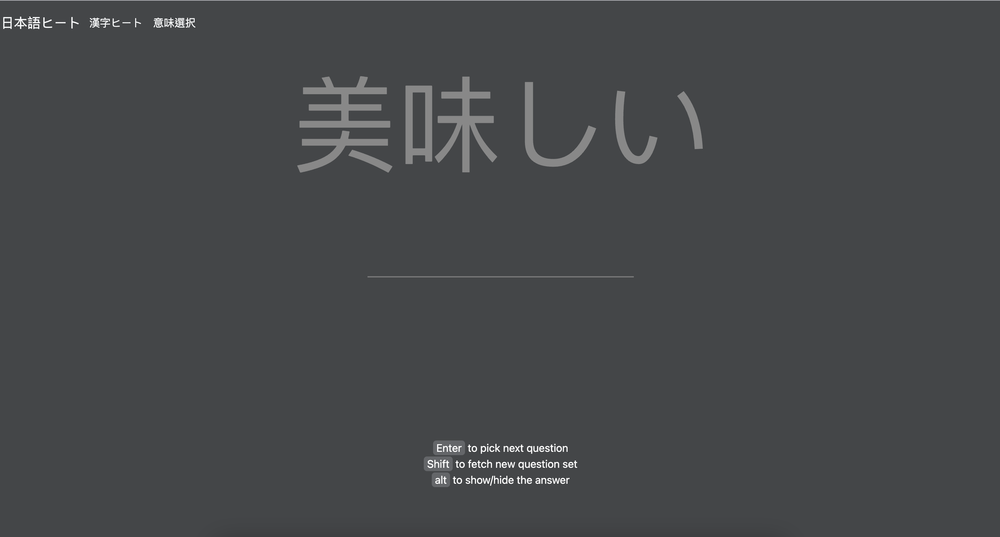

# 日本語ヒート

- A simple tool to practice your Japanese vocabulary

## Features
- support hiragana test given the kanji
- support traditional chinese meaning test for the given kanji 

## Anti-Features
- not support for mobiles

## Roadmaps
- [x] basic hiragana test for kanji
- [x] basic word's meaning test for kanji
- [ ] add loading status while fetch the data
- [ ] add the bar for recording correct submission
- [ ] change the way user fetch new question 

## Dictionary
- dictionary was saved in Google Sheet
- use Google Sheet API to access the data

